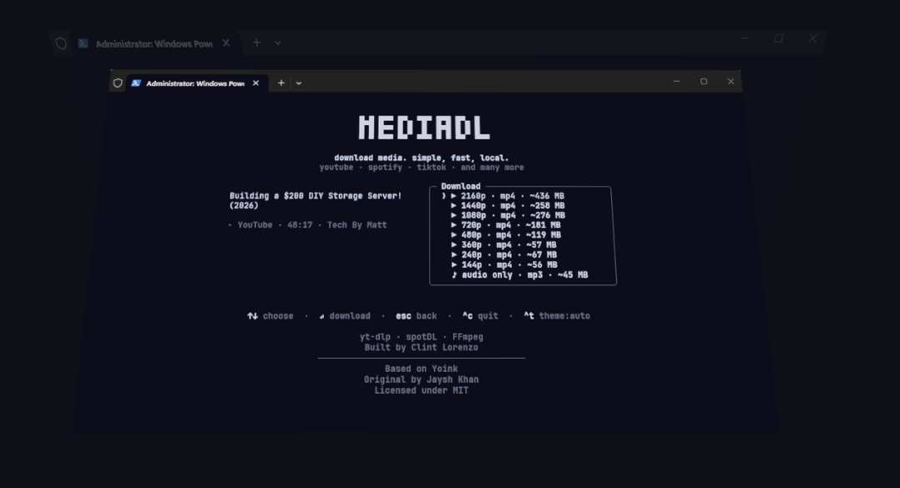
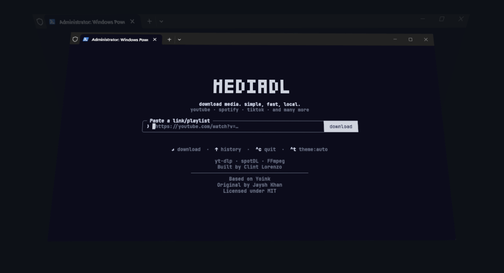
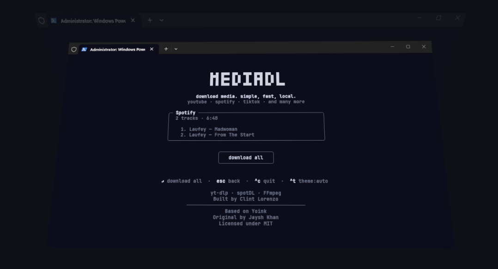

<p align="center">
  <picture>
    
  </picture>
</p>

<p align="center">
  download media. simple, fast, local.<br>
  <sub>youtube · spotify · tiktok · and many more</sub>
</p>

<p align="center">
  <a href="https://www.npmjs.com/package/mediadl-cli"></a>
  <a href="https://github.com/pablostanley/mediadl/blob/main/LICENSE"></a>
  <a href="https://nodejs.org"></a>
</p>

<p align="center">
  
</p>

---

Download videos from YouTube, TikTok, Instagram, X/Twitter, Threads and
1,800+ other sites. Download songs and playlists from Spotify with full
metadata. Paste a link, pick a format, done.

No popups, no fake download buttons, no sketchy redirects.

## Install

```sh
npm install -g mediadl-cli
```

Or run without installing:

```sh
npx mediadl-cli
```

Requires Node 18+. yt-dlp, FFmpeg, spotdl, and Deno are installed automatically on first use.

## Usage

```sh
$ mediadl https://youtu.be/dQw4w9WgXcQ         # pick a format, download
$ mediadl https://open.spotify.com/track/...     # download a single track
$ mediadl https://open.spotify.com/playlist/...  # download full playlist
$ mediadl https://www.tiktok.com/...             # download a video
$ mediadl                                        # prompts for a link
$ mediadl --theme dark                           # force dark mode
```

## Screenshots

<p align="center">
  
</p>

<p align="center">
  
</p>

## Keyboard Shortcuts

| Key | Action |
|-----|--------|
| `up/down` or `j/k` | Navigate formats |
| `Enter` | Confirm / Download |
| `Esc` | Go back |
| `Tab` | Paste clipboard URL |
| `Ctrl+T` | Cycle theme |
| `Ctrl+C` | Quit |

## How It Works

- **YouTube & 1800+ sites** — Powered by [yt-dlp](https://github.com/yt-dlp/yt-dlp). Standalone binary downloaded to `~/.mediadl/bin` on first run.
- **Spotify** — Powered by [spotdl](https://github.com/spotDL/spotify-downloader). Auto-installed via pip. Also installs Deno for YouTube downloads.
- **FFmpeg** — For merging streams and MP3 extraction. Uses system FFmpeg or bundled fallback.
- **UI** — Built with [Ink](https://github.com/vadimdemedes/ink) (React for the terminal).

## Output Locations

| Source | Location |
|--------|----------|
| YouTube, TikTok, etc. | `~/Downloads/` |
| Spotify single track | `~/Downloads/` |
| Spotify playlist/album | `~/Downloads/<Playlist Name>/` |

## Development

```sh
git clone https://github.com/kevlarclint/mediadl-cli.git
cd mediadl
npm install
npm run build        # bundle to dist/
npm run dev          # rebuild on change
npm run test         # run tests
npm run typecheck    # check types
```

To try it globally: `npm link`, then run `mediadl` anywhere.

## Credits

Forked from [yoinks](https://github.com/pablostanley/yoinks) by **Pablo Stanley**.

Built with:
- [yt-dlp](https://github.com/yt-dlp/yt-dlp) — Video downloads
- [spotdl](https://github.com/spotDL/spotify-downloader) — Spotify downloads
- [FFmpeg](https://ffmpeg.org) — Media processing
- [Ink](https://github.com/vadimdemedes/ink) — Terminal UI

## License

[MIT](LICENSE)
